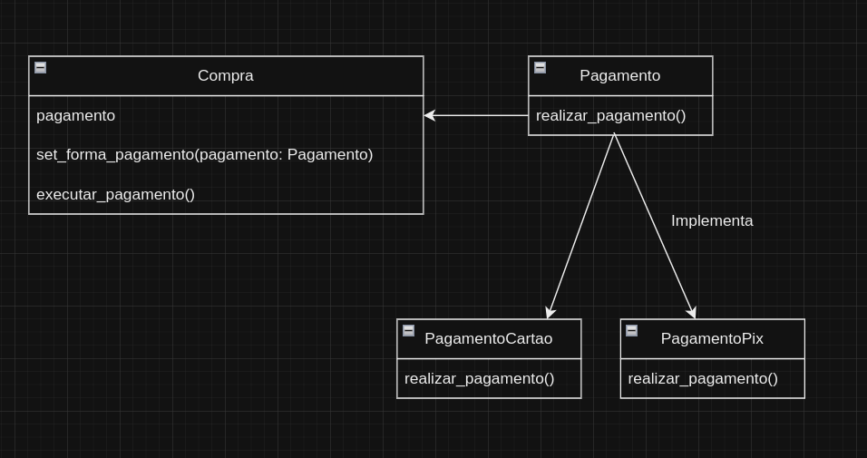
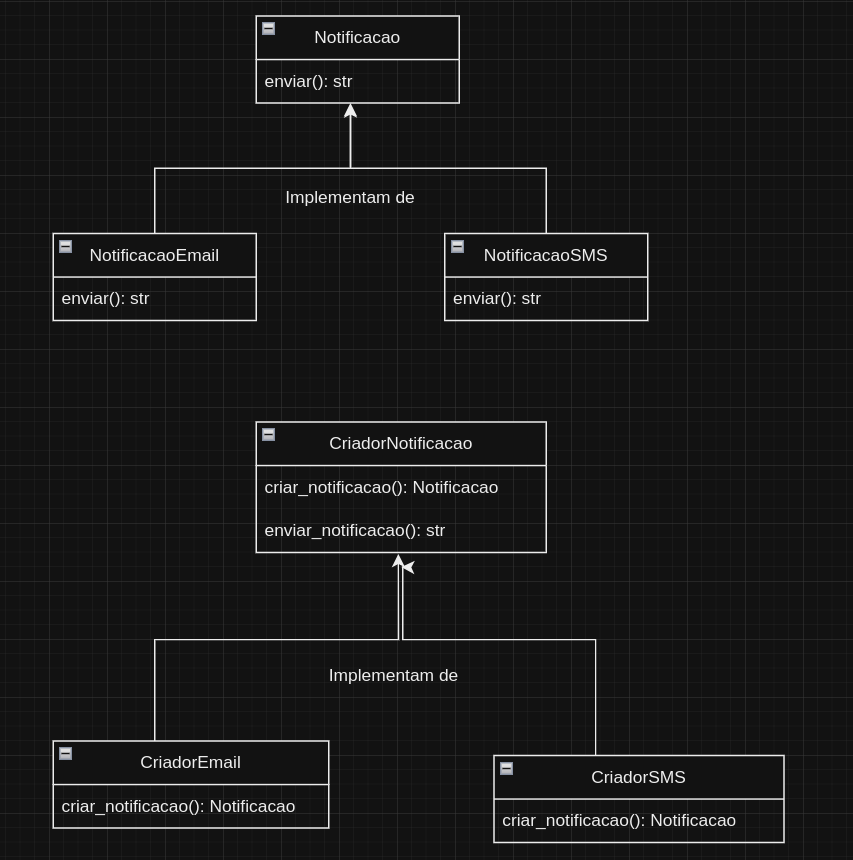
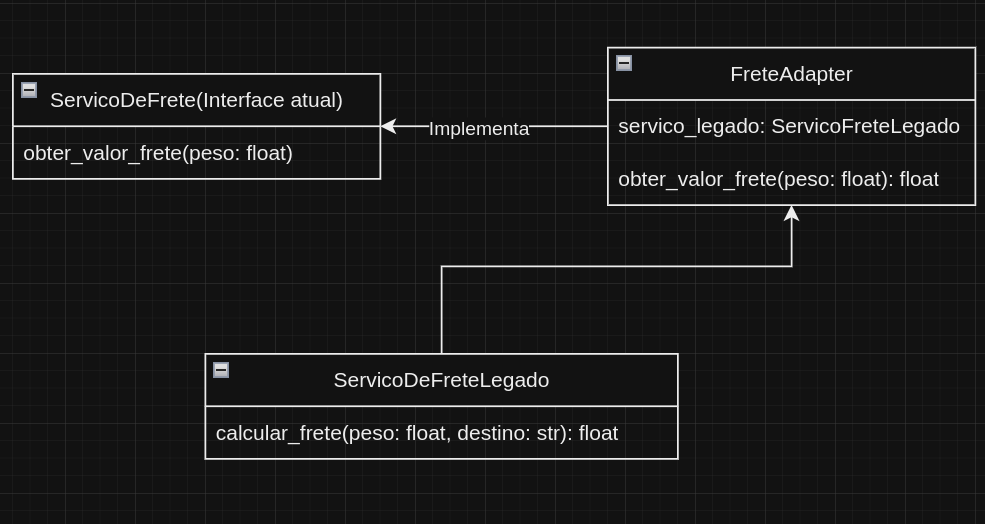

# Design Patterns

# Comportamental: Strategy Pattern

### Problema que resolve

O **Strategy Pattern** resolve o problema de ter múltiplos algoritmos ou estratégias para uma tarefa específica,
permitindo
que o comportamento de um objeto seja escolhido em tempo de execução. Esse padrão é útil quando você precisa selecionar
um algoritmo em tempo de execução ou quando um objeto deve mudar seu comportamento dependendo do estado ou contexto.

### Solução

A solução envolve a criação de uma interface para a estratégia (algoritmo) e implementações dessa interface.
Um contexto usa a interface da estratégia para delegar a execução da tarefa. A vantagem é que o código cliente pode
variar a estratégia sem mudar o código do contexto.

No arquivo presente na pasta `behaviorial-strategy` é possivel verificar o código citado a seguir

````python
# Interface de pagamento
from abc import ABC, abstractmethod


class Pagamento(ABC):
    @abstractmethod
    def realizar_pagamento(self, valor: float, tipo: str) -> str:
        pass
````

Esta interface de pagamento seria a estrategia de solução, que sera usada em seguinte pelos metodos de pagamento para
mudar a estratégia presente e delegar a execução de uma tarefa

````python
# Diferentes tipos de pagamento
from abc import ABC, abstractmethod


class PagamentoCartao(ABC):
    def realizar_pagamento(self, valor: float, tipo: str) -> str:
        return f"Pagou {valor} com o método {tipo} parcelado"


class PagamentoPix(ABC):
    def realizar_pagamento(self, valor: float, tipo: str) -> str:
        return f"Pagou {valor} com o método {tipo} a vista"
````

No codigo acima fica explicito o que foi dito anteriormente, o metodo é herdado e implementado de forma diferente para
cada metodo de pagamento

### UML



# Creational: Factory Method Pattern

### Problema que resolve

O **Factory Method Pattern** resolve o problema de criar objetos sem especificar a classe exata do objeto que será
criado. É útil quando você precisa criar uma instância de uma classe sem acoplar o código cliente à implementação
concreta da classe.

### Solução

Criar uma interface de criação de objetos e transferir a responsabilidade de criação para subclasses. Isso permite
que subclasses decidam qual classe instanciar.

No arquivo `.py` presente na pasta `creational-factory` é possivel verificar o código citado a seguir

```python
from abc import ABC, abstractmethod


# Criando os Criadores das notificações
class CriadorNotificacao(ABC):  # Criador abstrato para ser implementado por outras classes
    @abstractmethod
    def criar_notificacao(self) -> Notificacao:
        pass

    def enviar_notificacao(self) -> str:
        notificacao = self.criar_notificacao()
        return f"Criador: O mesmo código do criador funcionou com {notificacao.enviar()}"
```

No caso de cima, criamos uma class abstrata com o metodo de criar notifição de forma uma forma sem implementação.

Com isso, podemos implementar a chamada do criar_notificacao() especificamente no lugar que queremos chama-lo, por
exemplo:

```python
# Interface notificacao
class Notificacao(ABC):  # ABC é para indicar uma classe abstrata em python
    @abstractmethod  # Indica metodo abstrato
    def enviar(self) -> str:
        pass


# Criando os dois tipos de notificações existentes
class NotificacaoEmail(Notificacao):
    def enviar(self) -> str:
        return "Enviando notificação por Email"


class NotificacaoSMS(Notificacao):
    def enviar(self) -> str:
        return "Enviando notificação por SMS"


# Criando os criadores especificos para cada caso.
class CriadorEmail(CriadorNotificacao):
    def criar_notificacao(self) -> Notificacao:
        return NotificacaoEmail()


class CriadorSMS(CriadorNotificacao):
    def criar_notificacao(self) -> Notificacao:
        return NotificacaoSMS()

```

Neste caso, é feito a criação dos metodos de criar_notificacao() e sendo a chamada de uma outra classe anteriormente
declarada, que realizaria o envio especifico por SMS ou email

### UML



# Structural: Adapter Pattern

### Problema Resolvido

O **Adapter Pattern** resolve o problema de integrar classes com interfaces incompatíveis. Ele permite que um sistema
use uma classe com uma interface diferente da esperada pelo sistema atual, adaptando a interface de uma classe legada
para ser compatível com o sistema atual.

### Solução

A solucão consiste em: criar uma classe adaptadora que traduza a interface da classe legada para a interface esperada
pelo sistema. Isso permite que o sistema use a classe legada sem modificá-la.

Aqui podemos ver o exemplo da classe legada, que faz o calculo do frete para a empresa.

```python
# Classe do sistema legado que precisa ser adaptada
class ServicoDeFreteLegado:
    def calcular_frete(self, peso: float, destino: str) -> float:
        # Lógica para calcular frete
        return peso * 0.5
```

Sendo essa, a classe que o sistema atualizado espera receber para cmpletar o calculo do frete

```python
# Interface que o sistema atual espera
class ServicoDeFrete:
    def obter_valor_frete(self, peso: float) -> float:
        pass
```

O que o Adapter Pattern permite é basicamente pegar o ServicoDeFrete como dependencia do FreteAdapter, e fazer a mudanca
de ServicoDeFrete para ServiceDeFreteLegado, de certa forma, adaptando o novo estilo de frete para funcionar como antigo
estilo.

```python
# Adaptador que faz a ponte entre o sistema legado e o novo
class FreteAdapter(ServicoDeFrete):
    def __init__(self, servico_legado: ServicoDeFreteLegado):
        self.servico_legado = servico_legado

    def obter_valor_frete(self, peso: float) -> float:
        # Tradução da chamada para o método esperado pelo sistema legado
        destino_padrao = "São Paulo"  # Supondo um destino padrão
        return self.servico_legado.calcular_frete(peso, destino_padrao)
```

### UML


